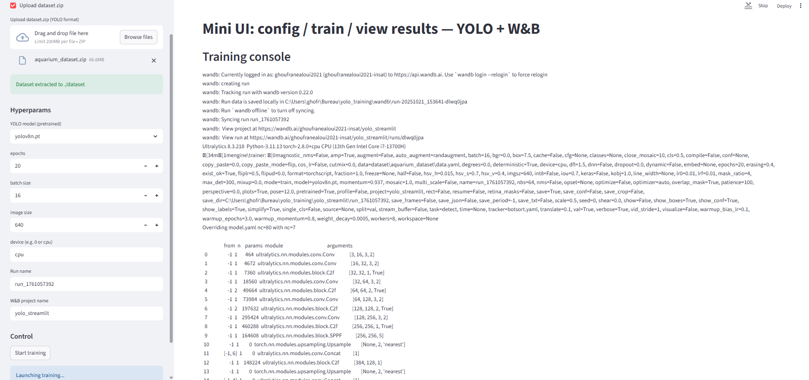

# StreamYOLO

A mini Streamlit UI to configure, train, and visualize YOLO object detection models with Weights & Biases (W&B) integration.

---

## 🚀 Features

- Upload your YOLO dataset (train/val/test) as a zip or provide a folder path.
- Select pretrained YOLO models: `yolov8n`, `yolov8s`, `yolov8m`.
- Set hyperparameters: epochs, batch size, image size, device, run name.
- Launch training directly from the UI.
- View real-time training logs in the UI.
- Automatically save 3 example detections on the validation set.
- View metrics locally and via W&B if connected.
- Handles dataset folder detection and `data.yaml` automatically.

---
## application Interface

---
## 📦 Installation

```bash
# Clone the repository
git clone https://github.com/ghofran190/StreamYOLO.git
cd StreamYOLO

# Create a conda environment (recommended)
conda create -n streamyolo python=3.10
conda activate streamyolo

# Install dependencies
pip install -r requirements.txt


